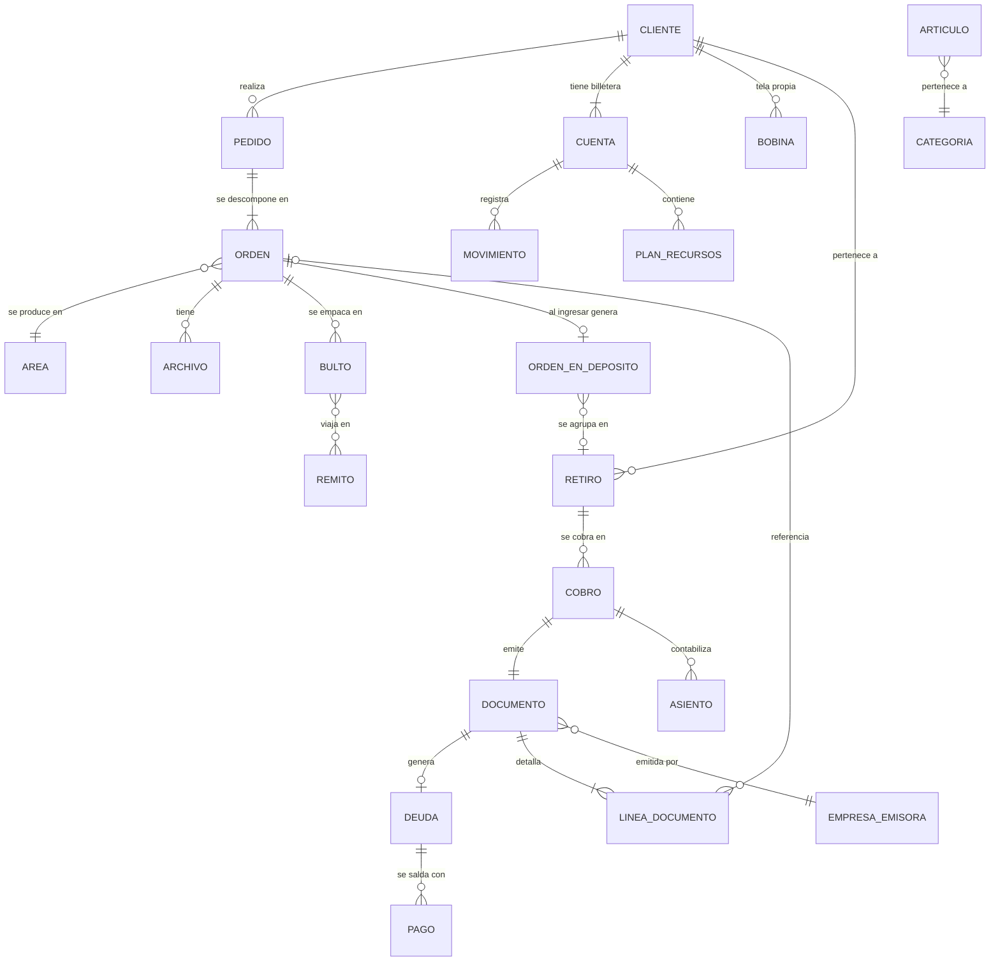

# Spec 11 — Modelo de Datos Conceptual

> **Propósito**: describir las entidades del negocio, sus relaciones y los invariantes que
> la base de datos del sistema nuevo debe garantizar **por estructura**. Deliberadamente
> **sin nombres de tablas ni campos**: el esquema físico, los nombres y la tecnología los
> decide el diseño nuevo. Lo que este documento fija es el QUÉ, no el CÓMO.
>
> Convención: cada entidad se describe por sus **atributos conceptuales** (qué información
> guarda, no cómo se llama la columna) y sus **relaciones** (cardinalidad). Los invariantes
> (INV) son las reglas que deben ser imposibles de violar.

## 1. Mapa general

## 2. Dominio: Partes

### Cliente
Identidad (nombre/razón social, documento fiscal, contacto), **tipo comercial** (común /
semanal-a-ciclo / rollo-prepago), estado (activo / bloqueado), zona y vendedor asignado,
condición de pago, y preferencias (aprobación de pedidos de diseñadores, forma de envío
por defecto). Guarda **dos correos separados** (comercial y del alta web) que nunca se
unifican.

### Usuario Interno
Identidad, credencial (**hash, nunca texto plano**), **rol** (relación a nomenclador de
roles) y **área asignada**. El rol otorga módulos; el área acota la operación.

### Diseñador
Identidad propia, estado de aprobación por la empresa, y **vínculos cliente↔diseñador**
creados por el cliente (N:M con vigencia).

### Empresa Emisora
Identidad fiscal completa, marca (logo, color), configuración del proveedor CFE
(credenciales cifradas, punto de emisión), flags activa y por-defecto.
**INV**: exactamente una empresa por defecto.

## 3. Dominio: Pedido y producción

### Pedido
Número correlativo único global. Cliente, canal de ingreso, quién lo cargó realmente
(cliente / diseñador / vendedor), nombre del proyecto, prioridad, forma de envío, estado
**derivado** de sus órdenes (nunca almacenado como verdad independiente).

### Orden
Unidad de trabajo en un área. Atributos: código de negocio (prefijo de área + número de
pedido + discriminador de hermanas), área, artículo/material, variante, **magnitud con su
unidad** (metros / m² / unidades / piezas / puntadas), prioridad, tinta u otros datos
técnicos, **costo sellado con moneda**, fecha prometida, próximo servicio (ruteo),
secuencia dentro del pedido, y sus **tres ejes de estado**: estado en área, estado general
(**derivado por jerarquía configurable**, jamás fijado a mano) y canasto/estado logístico;
más el estado de dependencia con **referencia tipada** a la orden que la libera.

- **INV-M.01** El código de negocio de la Orden es **único** (constraint, no convención).
- **INV-M.02** Una Orden pertenece a exactamente un Pedido y un Área.
- **INV-M.03** Los estados son nomencladores con clave estable y columnas de
  comportamiento (cuenta-como-pronta, es-final, bloquea-facturación…), no números mágicos.

### Archivo
De una Orden. **Tipificado** (arte de producción / boceto / referencia / tizada / logo /
prediseño / planilla / comprobante), con medidas y resolución, copias, estado de control
(pendiente / OK / falla / cancelado) y **contador de copias controladas**. Las tizadas
llevan su medición (piezas, metros de corte, metros de tela).

### Área
Nomenclador: código, nombre, **prefijo de numeración**, secuencia de proceso, modelo de
trabajo (lote / bandeja), parámetros (metros por bulto, hora de corte de urgentes,
admite urgencia, despacho parcial), y su mapeo a **sector comercial** (roll-up de
reportes).

### Lote
Agrupa órdenes compatibles de un área (**la compatibilidad —material/variante/tinta— es
regla estructural del área**). Nombre + **número propio**, estado, máquina asignada,
bobina montada.

### Máquina / Equipo
Área, nombre, activa, es-impresora, **capacidad real** (cabezales, velocidad con unidad,
preparación), slots de bobina.

### Bitácora de Producción
Lote + máquina + operario + intervalo de tiempo. Fuente del tiempo de máquina.

### Historial de Estados
De cada Orden: estado nuevo, fecha, **usuario obligatorio** (o actor de sistema
identificado), detalle. **INV-M.04**: toda transición pasa por un punto único que escribe
este historial; una transición sin autor es imposible.

### Falla / Reposición
Orden derivada de otra (relación madre→derivada con **linaje**: la falla de una falla
referencia a su antecesora). Tipo (falla interna / reposición de cliente), motivo
obligatorio, copias afectadas, máquina y lote de origen. **INV-M.05**: costo siempre 0;
una reposición no puede exceder la magnitud original.

### Calendario
Feriados administrables + horario laboral por área y día (con cruce de medianoche) +
tiempos prometidos por área y prioridad. Alimentan la fecha prometida y la capacidad.

## 4. Dominio: Logística

### Bulto
Orden a la que pertenece (**una sola referencia, tipada** — ver INV-L.01), numeración n/m,
tipo de contenido (producto terminado / en proceso / encomienda), **estado** (en stock /
en tránsito / consumido / procesado / perdido / entregado) y **ubicación actual**, con
registro de movimientos.

- **INV-L.01** Un Bulto de encomienda referencia al **Retiro** por una relación distinta
  de la que usa un bulto de producción para referenciar su **Orden**. Nunca una misma
  referencia con dos significados.
- **INV-L.02** Un bulto consumido o perdido no puede volver a despacharse ni reimprimirse
  (regla de transición de estados).

### Remito
Origen, destino, estado (esperando retiro / en tránsito [parcial] / recibido [parcial /
total] / entregado), **firmas**: quién firmó la salida y quién recibió, con fecha; ítems
(bultos) con estado individual; comprobante de entrega (encomiendas).
- **INV-L.03** No se puede firmar la salida de un remito ya recibido completo.

### Orden en Depósito
Nace en el check-in del depósito central (o en estado "esperando bultos" con contadores
esperados/recibidos). Importe con moneda, cantidad, producto, lugar de retiro, estado
(ingresado / para avisar / avisado / pronto / entregado / cancelado / perdido / avisar de
nuevo / esperando bultos), marca de avisado con fecha, marca de contabilizado (monto y
metros).
- **INV-L.04** A lo sumo **una fila viva por Orden** (las hermanas internas que no deben
  generar fila se resuelven por redirección a la madre, regla del dominio).

### Retiro
Cliente, órdenes en depósito que agrupa (N:M exclusiva: una orden vive en a lo sumo un
retiro activo), **moneda derivada de sus órdenes**, estado (pendiente-pasa-por-caja /
abonado / autorizado / empaquetado ±abonado / en viaje / entregado / cancelado), lugar y
datos de envío, estante asignado (a lo sumo uno; **un estante no mezcla clientes**),
autorizaciones sin pago (motivo, autorizador, gestión posterior).

## 5. Dominio: Dinero

### Cuenta (billetera del cliente)
Cliente, **tipo** (dinero por moneda / recurso por unidad), rol (principal — **una por
moneda por cliente**, constraint —, secundaria, restringida con lista blanca de
artículos), **modalidad fiscal** (anticipo-a-facturar / prepago-facturado), interruptores
(consumo automático, permite negativo), condición de pago, días de ciclo.
- **INV-D.01** La modalidad fiscal es inmutable una vez que la cuenta tiene movimientos.
- **INV-D.02** **No existe saldo acumulado almacenado como fuente de verdad**: el saldo es
  derivado de los movimientos (vista/cálculo), o si se materializa por rendimiento, se
  actualiza en un único punto y es siempre recalculable y verificable. Esta es la lección
  más cara del sistema actual.

### Movimiento (submayor)
De una Cuenta: tipo (nomenclador: orden, entrega, pago, anticipo, ajuste, cruce,
transferencia, saldo inicial, nota de crédito, recargo de urgencia…), importe **con
moneda y cotización cuando cruza moneda**, fecha, concepto, **referencias tipadas** al
documento, orden, pago, plan o transacción que lo originó, estado (vivo / anulado /
devuelto), autor.
- **INV-D.03** Un movimiento de dinero solo se anula por la reversa de la operación que lo
  creó, nunca por edición directa (candados del sistema actual convertidos en estructura).

### Plan de Recursos
Cuenta de recurso, artículo(s) permitidos, cantidad total / usada, importe pagado con
moneda, vigencia, estado. Sus entradas y consumos son Movimientos.
- **INV-D.04** Usado ≤ total (el sobregiro vive como movimiento negativo en la cuenta, no
  dentro del plan) y se hereda al plan siguiente por regla de dominio.

### Sesión de Caja
Apertura (fondos por moneda, usuario), cierre (conteo por denominación, esperado,
diferencia, observaciones, PDF), estado. **INV-D.05**: a lo sumo una sesión abierta.

### Transacción de Caja / Cobro
Balde (central con sesión obligatoria / administrativa sin sesión), empresa, cliente,
fecha (retrofechable, nunca futura), estado (activa / anulada), detalle por orden,
**medios de pago** (N por cobro: medio, importe, moneda, cotización, referencia a cheque
o adjunto), ajustes tipificados (descuento / redondeo / exoneración), autor.
- **INV-D.06** Idempotencia: la operación completa se aplica o se revierte; un reintento
  no puede duplicar un cobro.

### Cheque
Moneda, cotización, importe, banco, número, vencimiento, estado (en cartera / depositado /
…), **vínculo obligatorio al cobro** que lo recibió. Contablemente es "valores a
depositar", nunca caja.

## 6. Dominio: Facturación

### Documento
Tipo (**nomenclador estable**, jamás texto truncable), empresa emisora, cliente interno,
**receptor CFE congelado** (razón social, RUT/CI, dirección — independiente de la ficha),
nombre de fantasía propio, fechas (emisión editable pre-DGI, **fecha real DGI**), moneda y
cotización, totales, estado CFE (borrador / pendiente / aceptado / anulado), datos de
aceptación (CAE, serie y número oficiales, QR, **tipo CFE efectivamente enviado**),
referencia al documento original (NC/ND, con los datos del original congelados), condición
contado/crédito, marca de pagado (derivada de sus deudas).
- **INV-F.01** Aceptado por DGI ⇒ inmutable (solo reversible por NC).
- **INV-F.02** El total de la cabecera y la suma de las líneas cierran por el mismo
  importe (verificable por estructura o por guard transaccional).

### Línea de Documento
Documento, descripción, cantidad, **precio unitario bruto + % de descuento guardado tal
cual**, neto/IVA/total, **moneda y cotización de conversión usada**, y **referencias
estructuradas** (no texto libre): orden, retiro, área/sector, variante, artículo.

### Deuda
Documento (**a lo sumo una viva por documento — constraint UNIQUE filtrada**), cuenta
(de la que hereda la moneda), fecha del documento (no de alta), vencimiento por condición
de pago, importe y pendiente, estado (pendiente / parcial / cobrada / vencida /
cancelada).

### Pago
Deuda(s) imputadas con importe por deuda, cobro que lo originó, tipo (real / anticipo
aplicado / exoneración / sintético), estado.

### Ciclo de Facturación
Cuenta, vigencia, estado (abierto / cerrado / anulado), documento de cierre, descuento
global, órdenes/movimientos incluidos y excluidos.

### Recibo (cobro y anticipo)
Series de numeración **separadas** por tipo; todos los caminos de emisión comparten el
numerador de su tipo (secuencias transaccionales).

### Asiento
Cabecera (fecha, concepto, origen, usuario, transacción vinculada) + líneas (cuenta
contable imputable, debe/haber, **importe local + importe original + moneda +
cotización**, entidad imputada). **INV-F.03**: mínimo dos líneas y cuadre obligatorio,
dentro de la transacción de la operación que lo genera.

### Cuenta Contable / Evento Contable
Plan de cuentas administrable (código, nivel, tipo base, moneda, imputable). Eventos
contables configurables con sus reglas de asiento y comportamiento de submayor
(metavalores resueltos por moneda en ejecución).

## 7. Dominio: Catálogo

### Artículo / Categoría / Grupo
Jerarquía: super-familia → grupo (mapea a área y perfiles) → categoría/variante de stock
(unidad, **tipo de stock**: material / producto terminado / producto local / terminación)
→ artículo. **INV-C.01**: el artículo tiene identificador único global (no un código
repetible entre grupos).

### Terminación
Catálogo propio (unidad de cobro, regla de cantidad, ubicaciones, elige-el-cliente),
vínculo N:M con materiales, artículo de cobro asociado (requisito para tener precio).

### Combo
Artículo compuesto: componentes con variante de depósito y cantidad por combo. Stock
armable **calculado**, nunca almacenado.

### Vínculo WMS
Mapeo artículo local ↔ producto externo con **clave estable** (no por nombre), variantes
con SKU, precio de excepción por variante con moneda, ubicación de picking, imágenes.

### Publicación de Tienda / Producto Configurado
Capa de vitrina (publicado, solapa, textos de venta, orden) separada del catálogo.
Configuración de producto (origen de venta, política de cantidad, técnicas con modo y
cobro, componentes, apliques, variantes generadas con precio calculado + override, ficha
de diseño como unidad).

### Precio Base / Perfil / Excepción
Precio por **artículo + moneda** (UNIQUE). Perfiles con reglas escalonadas (alcance,
escalón, tipo, valor, moneda; globales o asignados). Excepciones por cliente (máxima
prioridad; únicas autorizadas a fijar precio 0).

### Cotización de Moneda
Una por día, fuente, valor; **toda conversión en el sistema referencia la cotización
usada**.

## 8. Dominio: Recursos físicos

### Bobina
Dueño (empresa o cliente), insumo/tela, medidas **declaradas** y **reales** (separadas),
saldo físico, estado (pendiente / disponible / en uso / agotada / cerrada), área,
etiqueta única.
- **INV-R.01** Todo cambio de saldo tiene su Movimiento de Recurso (mismo principio que
  INV-D.02/03): una bobina no puede quedar agotada ni cambiar de saldo sin un movimiento
  que lo explique, garantizado por la operación transaccional única que hace ambas cosas.

### Movimiento de Recurso
Bobina o cuenta de recurso, tipo (ingreso, consumo por orden, consumo de producción,
ajuste tipificado, merma, reserva/liberación, devolución, confirmación de medida),
cantidad con signo, referencia a orden/lote, autor. El saldo corrido se computa **por
bobina**.

## 9. Dominio: Comunicación y auditoría

### Aviso (WhatsApp / push / email)
Por orden o pedido: canal, estado (**enviado / simulado / error — siempre distinguidos**),
fecha, destinatario real, referencia. La marca "avisado" de la orden se deriva de un aviso
**realmente enviado**.

### Historial de Envíos de Email
Único y compartido: módulo, referencia legible, cliente, destinatario, asunto, adjunto,
estado, proveedor, error, usuario, fecha.

### Auditoría
Toda operación de negocio (no solo login y cambios de estado): quién, cuándo, desde dónde,
qué, antes→después donde aplique. Persistente (no en memoria).

### Configuración
Global tipada (clave única + valor + tipo + descripción + default) para flags sueltos;
configuración por entidad (empresa, área, cliente, servicio del portal) en su propia
estructura.

## 10. Los diez invariantes maestros

Síntesis de lo que la base nueva garantiza **por estructura**, cada uno pagado con un
incidente real en el sistema actual:

1. **Una referencia, un significado** — ninguna relación apunta a entidades distintas
   según contexto (bultos de encomienda).
2. **Un documento, una deuda viva** — UNIQUE, no disciplina de código (deudas duplicadas).
3. **Saldos derivados, nunca acumuladores huérfanos** — el saldo se calcula o se
   materializa con actualización en un punto único verificable (saldo corrompido por doble
   conteo).
4. **Todo importe viaja con moneda y cotización** — un importe sin moneda es un dato
   incompleto (cobros 40× por cruce de moneda).
5. **Nomencladores con clave estable, nunca texto truncable** — (NC emitidas como ventas
   por un campo corto).
6. **Documentos históricos congelados** — precios, receptor y cotización sellados al
   emitir; lo aceptado por DGI, inmutable.
7. **Toda operación con su reversa completa** — anular revierte todo lo que la operación
   creó, y jamás retrocede estados físicos (entregas "des-entregadas", planes vivos tras
   anular la venta).
8. **Cambios de saldo y su movimiento son atómicos** — nunca un descuento sin registro ni
   un registro sin descuento (ledger vs físico divergentes).
9. **Idempotencia en operaciones de dinero y de estado** — reintentos y dobles clicks no
   duplican (cobros dobles, doble envío de pedido, finalizar × 4).
10. **Toda transición con autor** — historial obligatorio con usuario o actor de sistema;
    sin autor, la operación no existe.
